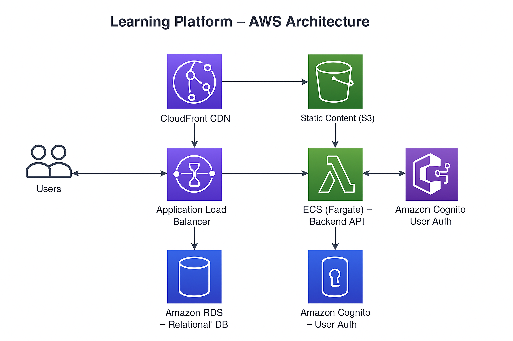

🧠 Learning Platform – AWS Architecture (ECS-Based)
This project outlines an AWS-based architecture for a scalable Learning / Training Website built with modern cloud-native services. The solution is designed for platforms offering video lessons, quizzes, user progress tracking, and secure authentication.

📌 Use Case
A dynamic learning web application serving thousands of users with features such as:

User authentication (email/social)

Video lessons and learning materials

Interactive quizzes and scoring

Progress tracking and dashboards

🧱 Architecture Overview
This solution uses Amazon ECS with Fargate for the backend API and Amazon S3 + CloudFront for static content and videos. It leverages Amazon RDS for relational data, and Amazon Cognito for secure user authentication.

⚙️ Components
Component	Purpose
Amazon S3	Hosts static files (HTML, CSS, JS), course videos, and documents
Amazon CloudFront	Caches and delivers static files globally with low latency
Amazon ECS (Fargate)	Runs Docker containers with backend logic (e.g., Node.js, Django)
Application Load Balancer (ALB)	Distributes dynamic requests to ECS services
Amazon RDS (PostgreSQL/MySQL)	Stores user data, quiz results, course progress
Amazon Cognito	Handles user sign-up, login, and authentication tokens
Amazon Route 53	DNS management for custom domain
Amazon CloudWatch	Logs, metrics, and performance monitoring

🖼️ Architecture Diagram 

🚀 Flow Summary
Frontend is delivered from S3 via CloudFront for speed and global reach.

Users interact with dynamic features (quizzes, profiles) via API endpoints routed through ALB to ECS containers.

The ECS-based backend handles business logic and communicates with RDS.

Cognito manages authentication and authorization securely.

Logs and performance metrics are captured via CloudWatch for observability.

✅ Key Benefits
✅ Scalable backend and frontend with auto-scaling via ECS and CloudFront

✅ Secure authentication using Cognito with built-in token management

✅ Reliable storage with S3 (for videos) and RDS (for user/quiz data)

✅ Flexible backend logic using containerized microservices

✅ Global delivery and caching for faster user experience worldwide

🧪 Optional Enhancements
Amazon ElastiCache (Redis): For caching frequently accessed quiz results or leaderboard data

AWS WAF: For additional security and request filtering

CI/CD Pipeline: Use CodePipeline + CodeBuild for automated deployments

🛠️ Tools & Technologies
Languages/Frameworks: Node.js, React, Django, or any backend that runs in Docker

Database: PostgreSQL / MySQL (RDS)

Authentication: Cognito User Pools

Infrastructure as Code: AWS CDK or CloudFormation recommended